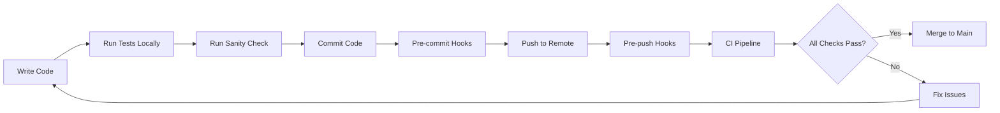

# Testing & Quality Assurance Guide

This guide covers the testing framework, CI/CD pipeline, and quality assurance processes for the HR Admin System.

---

## Table of Contents

- [Testing Framework](#testing-framework)
- [Running Tests](#running-tests)
- [Writing Tests](#writing-tests)
- [CI/CD Pipeline](#cicd-pipeline)
- [Code Quality](#code-quality)
- [Documentation](#documentation)
- [Pre-commit Hooks](#pre-commit-hooks)
- [API Validation](#api-validation)

---

## Testing Framework

### Test Stack

- **Test Runner**: Jest 29.7+
- **Assertion Library**: Jest (built-in)
- **HTTP Testing**: Supertest 6.3+
- **Database**: In-memory PostgreSQL for integration tests
- **Coverage**: Jest coverage reports with lcov

### Test Structure

```
tests/
├── fixtures/           # Test data and mock objects
│   ├── department.fixtures.ts
│   ├── employee.fixtures.ts
│   └── user.fixtures.ts
├── helpers/           # Test utilities
│   └── database.helper.ts
├── integration/       # API integration tests
│   └── department.api.test.ts
├── unit/             # Unit tests
│   └── services/
│       └── DepartmentService.test.ts
└── setup.ts          # Global test configuration
```

---

## Running Tests

### All Tests

```bash
# Run all tests with coverage
npm test

# Run tests in watch mode
npm run test:watch

# Run tests for CI (optimized)
npm run test:ci
```

### Unit Tests

```bash
# Run only unit tests
npm run test:unit

# Watch mode
npm run test:unit -- --watch
```

### Integration Tests

```bash
# Run only integration tests
npm run test:integration

# With verbose output
npm run test:integration -- --verbose
```

### Coverage Reports

```bash
# Generate coverage report
npm test

# View coverage in browser
open coverage/lcov-report/index.html
```

**Coverage Goals:**
- Overall: 80%+
- Statements: 80%+
- Branches: 75%+
- Functions: 80%+
- Lines: 80%+

---

## Writing Tests

### Unit Test Example

```typescript
import { DepartmentService } from '../../../src/services/DepartmentService';
import { createMockDepartment } from '../../fixtures/department.fixtures';

describe('DepartmentService', () => {
  let service: DepartmentService;
  let mockRepository: jest.Mocked<IDepartmentRepository>;

  beforeEach(() => {
    mockRepository = {
      findAll: jest.fn(),
      findById: jest.fn(),
      // ... other methods
    };
    service = new DepartmentService(mockRepository);
  });

  it('should return all departments', async () => {
    const mockDepts = [createMockDepartment()];
    mockRepository.findAll.mockResolvedValue(mockDepts);

    const result = await service.getAllDepartments();

    expect(result).toEqual(mockDepts);
    expect(mockRepository.findAll).toHaveBeenCalledTimes(1);
  });
});
```

### Integration Test Example

```typescript
import request from 'supertest';
import { App } from '../../src/app';

describe('Department API', () => {
  let app: Express.Application;
  let authToken: string;

  beforeAll(async () => {
    await initializeTestDatabase();
    const appInstance = new App();
    app = appInstance.getExpressApp();
    authToken = await getAuthToken();
  });

  it('should create a department', async () => {
    const response = await request(app)
      .post('/api/v1/departments')
      .set('Authorization', `Bearer ${authToken}`)
      .send({ name: 'Engineering' })
      .expect(201);

    expect(response.body.success).toBe(true);
    expect(response.body.data).toHaveProperty('id');
  });
});
```

### Test Fixtures

```typescript
// tests/fixtures/department.fixtures.ts
export const createMockDepartment = (overrides?: Partial<Department>) => {
  return {
    id: '123e4567-e89b-12d3-a456-426614174000',
    name: 'Test Department',
    description: 'Test description',
    ...overrides,
  };
};
```

### Testing Best Practices

1. **Arrange-Act-Assert Pattern**: Structure tests clearly
2. **Descriptive Test Names**: Use `it('should ...')` format
3. **One Assertion Per Test**: Focus each test on one behavior
4. **Mock External Dependencies**: Use Jest mocks for repositories
5. **Clean Up**: Use `afterEach` to reset mocks
6. **Async/Await**: Prefer async/await over promises
7. **Test Edge Cases**: Include error scenarios

---

## CI/CD Pipeline

### GitHub Actions Workflow

Located at `.github/workflows/ci.yml`

### Pipeline Stages

#### 1. **Lint**
- Runs ESLint on all TypeScript files
- Checks code formatting with Prettier
- Fails if any linting errors

#### 2. **Test**
- Sets up PostgreSQL test database
- Runs unit tests
- Runs integration tests
- Generates coverage reports
- Uploads coverage to Codecov

#### 3. **Build**
- Compiles TypeScript to JavaScript
- Verifies build artifacts
- Checks for compilation errors

#### 4. **Security**
- Runs `npm audit`
- Checks for high-severity vulnerabilities
- Reports security issues

### Environment Variables (CI)

```yaml
env:
  NODE_ENV: test
  DB_HOST: localhost
  DB_NAME: hr_admin_db_test
  JWT_SECRET: test_jwt_secret_key...
  BCRYPT_ROUNDS: 10
```

### Triggering CI

```bash
# Automatic triggers
git push origin main          # Push to main
git push origin develop       # Push to develop
gh pr create                  # Create pull request

# Manual trigger
gh workflow run ci.yml
```

### CI Status Badges

Add to README.md:

```markdown


```

---

## Code Quality

### Linting

```bash
# Run ESLint
npm run lint

# Auto-fix issues
npm run lint:fix
```

**ESLint Rules:**
- TypeScript strict mode
- No unused variables
- Explicit return types
- No `any` types
- Proper error handling

### Code Formatting

```bash
# Format code
npm run format

# Check formatting
npm run format:check
```

**Prettier Config:**
- Single quotes
- Semicolons
- 100 char line width
- 2-space indentation

### Sanity Check

```bash
# Run comprehensive pre-commit checks
npm run sanity-check
```

**Checks:**
1. ✓ Node.js version (>=18)
2. ✓ Dependencies installed
3. ✓ TypeScript compilation
4. ✓ ESLint passing
5. ✓ Code formatting
6. ✓ Unit tests passing
7. ⚠️ Console.log warnings
8. ⚠️ TODO comments
9. ✓ Environment files
10. ⚠️ Sensitive data check
11. ✓ Security audit

---

## Documentation

### API Documentation (Swagger)

**Generate API docs:**

```bash
# Swagger docs available at /api-docs
npm run dev
# Navigate to http://localhost:3000/api-docs
```

**Swagger Features:**
- Interactive API explorer
- Request/response schemas
- Authentication testing
- Example requests
- Response codes

### Code Documentation (TypeDoc)

```bash
# Generate TypeDoc documentation
npm run docs:generate

# Serve documentation locally
npm run docs:serve
# Navigate to http://localhost:3000
```

**TypeDoc Output:**
- Class documentation
- Method signatures
- Interface definitions
- Type information
- Cross-references

### Documentation Structure

```
docs/
├── index.html              # Main documentation
├── classes/               # Class documentation
├── interfaces/            # Interface documentation
├── modules/              # Module documentation
└── assets/               # Documentation assets
```

---

## Pre-commit Hooks

### Setup Husky

```bash
# Install Husky
npm install

# Husky is automatically configured via package.json
```

### Available Hooks

#### Pre-commit
```bash
# Runs automatically before git commit
- Linting (ESLint)
- Format check (Prettier)
```

#### Pre-push
```bash
# Runs automatically before git push
- Full sanity check
- TypeScript compilation
- Unit tests
- Code quality checks
```

### Manual Hook Execution

```bash
# Run pre-commit checks manually
npm run precommit

# Run pre-push checks manually
npm run prepush
```

### Skip Hooks (Emergency Only)

```bash
# Skip pre-commit hook
git commit --no-verify -m "message"

# Skip pre-push hook
git push --no-verify
```

⚠️ **Warning**: Only skip hooks in emergencies. Always run checks locally.

---

## API Validation

### Automated API Testing

```bash
# Start server
npm run dev

# In another terminal, run API validation
npm run validate-api
```

**Validation Tests:**
1. ✓ Server is running
2. ✓ Health endpoint responds
3. ✓ Authentication works
4. ✓ Login returns token
5. ✓ Departments endpoint accessible
6. ✓ Employees endpoint accessible
7. ✓ Protected endpoints require auth

### Custom API URL

```bash
# Test against different environment
API_URL=http://staging-api.example.com/api/v1 npm run validate-api

# Test with custom credentials
ADMIN_EMAIL=admin@test.com ADMIN_PASSWORD=test123 npm run validate-api
```

### API Health Checks

```bash
# Check API health
curl http://localhost:3000/api/v1/health

# Response:
{
  "success": true,
  "data": {
    "status": "OK",
    "timestamp": "2024-01-14T10:30:00.000Z",
    "uptime": 3600
  }
}
```

---

## Continuous Quality Assurance

### Development Workflow



### Quality Gates

**Before Commit:**
- ✓ Linting passes
- ✓ Formatting correct
- ✓ No TypeScript errors

**Before Push:**
- ✓ All unit tests pass
- ✓ Build successful
- ✓ No security issues
- ✓ Code quality metrics met

**Before Merge:**
- ✓ CI pipeline green
- ✓ Code review approved
- ✓ Integration tests pass
- ✓ Coverage requirements met

---

## Troubleshooting

### Tests Failing

```bash
# Clear Jest cache
npx jest --clearCache

# Run tests with verbose output
npm test -- --verbose

# Run specific test file
npm test -- tests/unit/services/DepartmentService.test.ts
```

### Database Issues in Tests

```bash
# Check PostgreSQL is running
pg_isready

# Recreate test database
dropdb hr_admin_db_test
createdb hr_admin_db_test
psql -d hr_admin_db_test -c 'CREATE EXTENSION IF NOT EXISTS "uuid-ossp";'
```

### CI Pipeline Failures

1. Check GitHub Actions logs
2. Verify environment variables
3. Ensure PostgreSQL service is healthy
4. Check for flaky tests
5. Review recent code changes

### Coverage Not Meeting Requirements

```bash
# Generate detailed coverage report
npm test -- --coverage --verbose

# Identify uncovered lines
open coverage/lcov-report/index.html
```

---

## Best Practices

### Testing

1. **Write Tests First**: TDD when possible
2. **Test Behavior, Not Implementation**: Focus on what, not how
3. **Keep Tests Fast**: Use mocks for external dependencies
4. **Maintain Test Data**: Keep fixtures up to date
5. **Review Coverage**: Aim for meaningful coverage, not just numbers

### Code Quality

1. **Consistent Style**: Follow ESLint/Prettier rules
2. **Descriptive Names**: Use clear variable and function names
3. **Small Functions**: Keep functions focused and small
4. **Document Complex Logic**: Add comments for non-obvious code
5. **Handle Errors**: Always handle errors gracefully

### CI/CD

1. **Fast Feedback**: Keep CI pipeline under 5 minutes
2. **Fail Fast**: Run quick checks (lint) before slow checks (tests)
3. **Meaningful Logs**: Provide clear error messages
4. **Automated Deployment**: Deploy automatically on successful builds
5. **Monitor Performance**: Track build times and test durations

---

## Resources

- [Jest Documentation](https://jestjs.io/docs/getting-started)
- [Supertest Documentation](https://github.com/visionmedia/supertest)
- [GitHub Actions Documentation](https://docs.github.com/en/actions)
- [ESLint Rules](https://eslint.org/docs/rules/)
- [Swagger/OpenAPI Specification](https://swagger.io/specification/)
- [TypeDoc Documentation](https://typedoc.org/)

---

**Built with quality and reliability in mind! 🚀**
